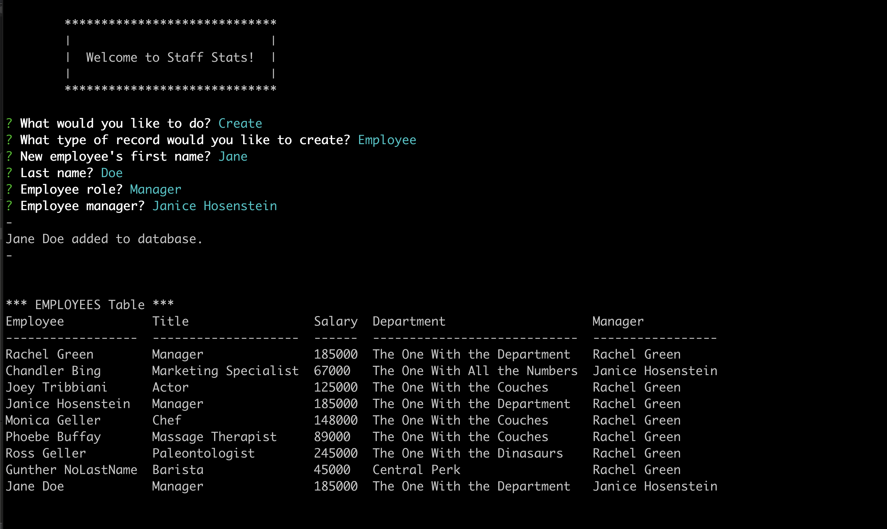

  
  # Staff Stats Displayer

  Staff Stats Displayer is a helpful program to keep track of employees, their roles, salaries, and departments.

  [You can view a video walkthrough of the app here:](https://youtu.be/orWNiKmF-Pc "View Staff Stats Displayer App") https://youtu.be/orWNiKmF-Pc

## Table of Contents
- [Usage](#How-to-use)
- [Languages](#Languages-and-Lessons)
- [Contribute](#How-to-contribute)
- [Questions](#Developed-by)
- [Credits](#Acknowledgments-and-Credits)
- [License](#Licensed-under-MIT)

## How to use
The app is very easy to use. Start the app with Node then follow the prompts to add, update, or view records of employees.

## Languages and Lessons
The exercises in this project focussed on learning SQL, I also took the opportunity to increase my understanding of promises and converted the callback based query functions to promises to help me use the results of those queries as Inquirer prompts.

## How to contribute
If anyone would like to improve the app by contributing, they're welcome to submit a pull request on [GitHub](https://github.com/keiththarp/staff-stats-displayer).

## Developed by
- [Keith Tharp](https://github.com/keiththarp)

Please reach out with questions at:
  - keithstharp@gmail.com

Find more of Keith Tharp's work at:
  - https://github.com/keiththarp

## Acknowledgments and Credits
Thank you to all my fellow students and study groups that helped and supported with this homework project!
Special thanks to [Tiffany](https://github.com/tiffany-brand), [Michael](https://github.com/FearMichael), and [Bobby](https://github.com/rhoffman103) for the help and encouragement with promises!

## Licensed under MIT
[Click here for more information on the MIT license.](https://choosealicense.com/licenses/mit/)
